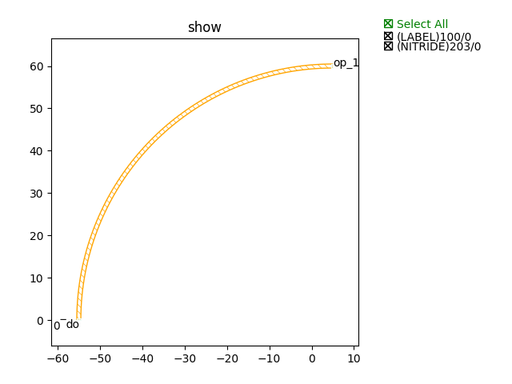
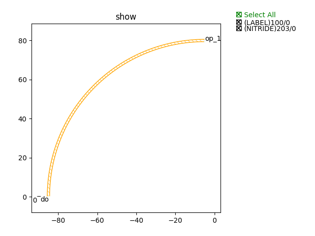

Bend
#############################

SiN300nm_1310nm_TE_STRIP_90_Degr
**********************************************************

+-------------------+-----------------------------+-------------+
|     ports         |     waveguide type          | orientation |
+===================+=============================+=============+
|     op_0          |  TECH.WG.SIN_STRIP.O.WIRE   |   270       |
+-------------------+-----------------------------+-------------+
|     op_1          |  TECH.WG.SIN_STRIP.O.WIRE   |     0       |
+-------------------+-----------------------------+-------------+

SiN300nm_1550nm_TE_STRIP_90_Degr
**********************************************************

+-------------------+-----------------------------+-------------+
|     ports         |     waveguide type          | orientation |
+===================+=============================+=============+
|     op_0          |  TECH.WG.SIN_STRIP.C.WIRE   |   270       |
+-------------------+-----------------------------+-------------+
|     op_1          |  TECH.WG.SIN_STRIP.C.WIRE   |     0       |
+-------------------+-----------------------------+-------------+
