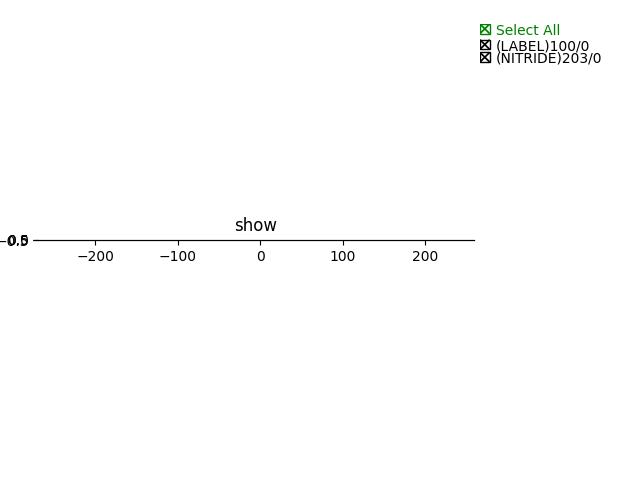
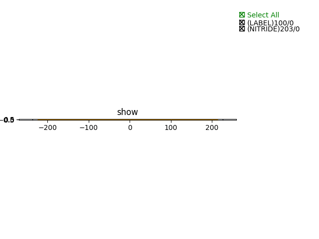

Waveguide
#############################

SiN300nm_1310nm_TE_STRIP_Wavegui
**********************************************************

+-------------------+-----------------------------+-------------+
|     ports         |     waveguide type          | orientation |
+===================+=============================+=============+
|     op_0          |  TECH.WG.SIN_STRIP.O.WIRE   |   180       |
+-------------------+-----------------------------+-------------+
|     op_1          |  TECH.WG.SIN_STRIP.O.WIRE   |     0       |
+-------------------+-----------------------------+-------------+

SiN300nm_1550nm_TE_STRIP_Wavegui
**********************************************************

+-------------------+-----------------------------+-------------+
|     ports         |     waveguide type          | orientation |
+===================+=============================+=============+
|     op_0          |  TECH.WG.SIN_STRIP.C.WIRE   |   180       |
+-------------------+-----------------------------+-------------+
|     op_1          |  TECH.WG.SIN_STRIP.C.WIRE   |     0       |
+-------------------+-----------------------------+-------------+

SOI220nm_1550nm_TE_RIB_Waveguide
**********************************************************
.. image:: ../images/SOI220nm_1550nm_TE_RIB_Waveguide.png

+-------------------+-----------------------------+-------------+
|     ports         |     waveguide type          | orientation |
+===================+=============================+=============+
|     op_0          |   TECH.WG.SOI_RIB.C.WIRE    |   180       |
+-------------------+-----------------------------+-------------+
|     op_1          |   TECH.WG.SOI_RIB.C.WIRE    |     0       |
+-------------------+-----------------------------+-------------+

SOI220nm_1550nm_TE_STRIP_Waveguide
**********************************************************
.. image:: ../images/SOI220nm_1550nm_TE_STRIP_Waveguide.png

+-------------------+-----------------------------+-------------+
|     ports         |     waveguide type          | orientation |
+===================+=============================+=============+
|     op_0          |  TECH.WG.SOI_STRIP.C.WIRE   |   180       |
+-------------------+-----------------------------+-------------+
|     op_1          |  TECH.WG.SOI_STRIP.C.WIRE   |     0       |
+-------------------+-----------------------------+-------------+
